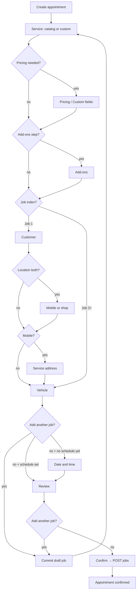

# Web replication: Multi-job appointment creation (from mobile)

**Audience:** Web app engineers mirroring owner **manual appointment create** with multiple jobs.  
**Scope:** Create flow only (not edit / complete / mark paid).  
**Mobile source:** `src/features/bookings/create-appointment/`  
**Server contract (payload / API):** [`OWNER_MANUAL_BOOKING_MULTI_JOB_SERVER.md`](./OWNER_MANUAL_BOOKING_MULTI_JOB_SERVER.md)

Use this doc to rebuild the **same product behavior and step graph** on web. Visual design can follow the web system; the visit vs job model, step order, skip rules, and “Add another job” UX should match.

---

## 1. Product model (must match)

| Concept                 | Meaning                                                                                                        |
| ----------------------- | -------------------------------------------------------------------------------------------------------------- |
| **Appointment (visit)** | One calendar block: one customer, one place, one start time, one status, one payment                           |
| **Job**                 | A line item on that visit: catalog service or custom, price, optional tier/add-ons, duration, optional vehicle |

Rules:

- Visit duration = **sum** of job durations.
- Free-tier / calendar / cancel / pay = **one appointment**, not one row per job.
- Always submit with `jobs[]` (even when length is `1`). Do not use the legacy single-job top-level service fields when multi-job is supported.
- Vehicle lives **on each job**, not on the visit customer object.
- Visit notes live on the appointment (`customer.notes`), collected once (on job 1 vehicle step on mobile).

**UI cap (mobile):** max **4** jobs per visit (`CREATE_APPOINTMENT_MAX_JOBS`). Server allows more; web should start with **4** unless product changes it.

---

## 2. Mental model: visit fields vs job fields

### Visit-level (set once on the first job pass)

| Field                                    | Step (mobile copy)              |
| ---------------------------------------- | ------------------------------- |
| Customer name, phone, optional email     | **Who's it for?**               |
| Mobile vs shop (if business offers both) | **Mobile or shop**              |
| Service address (mobile only)            | **Service address**             |
| Date + start time                        | **Date and time**               |
| Appointment notes                        | Collected with vehicle on job 1 |

### Job-level (repeat per job)

| Field                                                          | Step                                 |
| -------------------------------------------------------------- | ------------------------------------ |
| Catalog service **or** custom job                              | **What's the job?** / **Custom job** |
| Price tier + price (catalog) or name/price/duration (custom)   | **Pricing** / custom fields          |
| Add-ons (catalog only, optional)                               | **Add-ons**                          |
| Vehicle year / make / model (all optional, but all-or-nothing) | **What's the vehicle?**              |

---

## 3. End-to-end user journey

### 3.1 Job 1 (full visit setup)

```
Entry (e.g. “Create appointment”)
  → Service chooser (Your services | Custom job)
  → [Pricing / Custom details]     ← may skip for single-tier catalog
  → [Add-ons]                      ← skip for custom or zero add-ons
  → Customer
  → [Location]                     ← only if business mode is “both”
  → [Address]                      ← only if location is mobile
  → Vehicle (+ notes on job 1)
       ├─ “Add another job”  → commit job 1, loop to Service (job 2)
       └─ Continue           → Schedule → Review → Confirm
```

### 3.2 Job 2+ (job-only loop)

Customer / location / address / schedule are **not** shown again.

```
Service chooser
  → [Pricing / Custom]
  → [Add-ons]
  → Vehicle
       ├─ “Add another job”  → commit, loop again (until max)
       └─ Continue           → Review (schedule already chosen on job 1 path)
                              → or Schedule if somehow still missing, then Review
```

On mobile, after job 1’s vehicle, if the user already continued to schedule before adding more jobs, the next jobs skip schedule. Preferred UX: **stack jobs on Vehicle / Review first**, then schedule once, then confirm.

**Recommended web parity (same as mobile):**

1. Finish job details through **Vehicle**.
2. Offer **Add another job** on Vehicle and Review.
3. Collect **Date and time** once after the first job’s vehicle when no slot is set yet.
4. **Review** all jobs → **Confirm**.

### 3.3 Flow diagram



---

## 4. Service path: catalog vs custom

### Chooser UI (exact mobile strings)

| Card title        | Subtitle                              |
| ----------------- | ------------------------------------- |
| **Your services** | Choose something you already offer.   |
| **Custom job**    | Name the work and set your own price. |

### Catalog path

1. User picks **Your services** → list of active services.
2. Select one service → **Continue**.
3. **Pricing:** if more than one bookable tier, show tiers + editable price; if ≤1 tier, **skip** the step (price still on the job).
4. **Add-ons:** show if the service has add-ons; user may select none and continue. If zero add-ons, **skip** the step.

### Custom path

1. User picks **Custom job** → go straight to custom fields (same wizard “pricing” slot).
2. Required: **Service** name, **Price (USD)** (> $0), **Duration**.
3. **Add-ons step is skipped**.
4. Payload: omit `serviceId`; no tier label; no `selectedAddOns`.

Wizard header when on custom: **“Custom job”** / **“Name it, set a price, and estimate duration.”**

For job 2+ catalog list header: **“Choose service · Job N”** / **“Pick the next service for this visit.”**

---

## 5. “Add another job” (core UX to replicate)

### Where it appears

| Screen      | Placement                                 |
| ----------- | ----------------------------------------- |
| **Vehicle** | Below vehicle fields (and notes on job 1) |
| **Review**  | Below the jobs **Summary**                |

### Control

- Primary label: **Add another job**
- Style on mobile: full-width dashed secondary action (not the primary footer button)
- Disabled while the current step is invalid (`canContinue === false`)
- Hidden when already at max jobs (4)

### On press

1. Validate current draft (same rules as Continue on that step).
2. If at max → toast/info: **“You can add up to 4 jobs on one visit.”**
3. **Commit** the current job draft into a `committedJobs` array (snapshot).
4. **Reset** the live draft (clear service / price / add-ons / vehicle; new local id).
5. Navigate to **Service** chooser for the next job.
6. Do **not** clear visit fields (customer, address, schedule, notes).

### Canceling an in-progress extra job

If the user started job 2+ and backs out from the service chooser:

- Footer secondary: **Cancel job** (not “Cancel” the whole appointment).
- Restore the last committed job into the draft (or drop the empty draft) and return to **Review**.

### Removing a job on Review

- When `jobs.length > 1`, allow remove on a job row.
- Never allow removing the last job → **“Keep at least one job on this visit.”**

---

## 6. State model (implement this on web)

```
committedJobs: JobSnapshot[]   // frozen jobs after “Add another job”
draft: JobDraft | null         // job currently being edited in the wizard
visit: {
  customer, locationType, address, date, time, notes
}

jobIndex = committedJobs.length   // 0 = first job pass
visitJobs = committedJobs + (draft if present)
```

**Job snapshot** (minimum fields to mirror mobile):

- `localId` (client-only)
- `isCustomJob`
- `serviceId` / `serviceName`
- pricing option id/label + price cents
- selected add-ons (+ duration contribution)
- `durationMinutes` (job total)
- `vehicle: { year, make, model }`

**On Confirm:**

```
allJobs = draftPresent ? [...committedJobs, snapshot(draft)] : [...committedJobs]
POST body with jobs: allJobs
```

---

## 7. Wizard chrome & CTAs

| Situation                                | Primary                   | Secondary                                                   |
| ---------------------------------------- | ------------------------- | ----------------------------------------------------------- |
| Mid-flow steps                           | **Continue**              | **Back** (or **Cancel** on first step of a new appointment) |
| Service chooser while job 2+ in progress | **Continue** (after pick) | **Cancel job**                                              |
| Review                                   | **Confirm**               | **Back**                                                    |
| Success                                  | **Done**                  | —                                                           |

Progress: advance through the **visible** step list for the current `jobIndex` (skipped steps omitted from the bar).

---

## 8. Step skip rules (parity checklist)

| Step                                     | Skip when                                       |
| ---------------------------------------- | ----------------------------------------------- |
| Pricing (catalog)                        | ≤ 1 bookable price tier                         |
| Pricing (custom)                         | **Never** — custom UI lives here                |
| Add-ons                                  | Custom job **or** service has 0 add-ons         |
| Location                                 | Business is mobile-only or shop-only            |
| Address                                  | Location is **shop** (use profile shop address) |
| Customer / Location / Address / Schedule | `jobIndex > 0` (already set on visit)           |

Add-ons when shown: Continue always allowed with zero selections.

---

## 9. Validation (parity)

| Step             | Gate                                                                                   |
| ---------------- | -------------------------------------------------------------------------------------- |
| Service          | Catalog: service selected. Custom: continue from custom fields step, not empty chooser |
| Custom / pricing | Name, price > 0, duration > 0 (custom); valid tier + price (catalog)                   |
| Customer         | Full name + valid US 10-digit phone; email optional but valid if present               |
| Location         | `mobile` or `shop`; shop requires shop address on profile                              |
| Address          | Street, city, 2-letter state, 5-digit ZIP                                              |
| Vehicle          | All empty OK; if any filled, year + make + model all required                          |
| Schedule         | Business accepting bookings; date + time from open slots                               |
| Review           | Visit fields complete + at least one job complete                                      |

Before submit, re-check the selected slot is still available; if not, return to schedule with a clear error.

---

## 10. Review screen content

Sections (mobile):

1. **Summary** — one row per job (name, price, optional vehicle line); swipe/remove when multi-job
2. **Visit total** (if 2+ jobs) or **Total** (single job) — sum of job prices (+ sale discount if applicable)
3. **Schedule** — date + time
4. **Customer** — name / phone / email
5. **Service address** or **Shop address**
6. **Notes** (if any)
7. **Add another job** (if under max)

Then **Confirm**.

---

## 11. Success

1. Show submitting / loading state while `POST` runs.
2. On success: **Appointment confirmed** — e.g. “You’re all set—it’s on your calendar. Check Bookings for details.”
3. **Done** closes the wizard (back to calendar / home).
4. Optional toast if confirmation email/SMS was sent.

One booking id is returned; that is the appointment id for the whole visit.

---

## 12. API (summary — full detail in server doc)

- `POST /api/public/bookings`
- Auth: owner Bearer token
- `ownerManualBooking: true`
- Appointment fields: `businessSlug`, `businessId`, `scheduledDate`, `startTime`, `serviceLocationType`, `customer` (with address + notes), `paymentMethodSelected: "none"`, **`jobs: [...]`**
- Each job: `serviceName`, `servicePriceCents`, `durationMinutes`, `vehicle`, plus catalog `serviceId` / tier / `selectedAddOns` when applicable

See [`OWNER_MANUAL_BOOKING_MULTI_JOB_SERVER.md`](./OWNER_MANUAL_BOOKING_MULTI_JOB_SERVER.md) for field tables and examples.

---

## 13. Web implementation checklist

- [ ] Visit vs job field ownership matches §2
- [ ] Job 1 full path + job 2+ shortened path match §3
- [ ] Service chooser: Your services + Custom job
- [ ] Skip rules for pricing / add-ons / location / address
- [ ] **Add another job** on Vehicle + Review; commit/reset/draft model
- [ ] Max 4 jobs with clear messaging
- [ ] Cancel job for in-progress job 2+
- [ ] Review shows all jobs + Visit total
- [ ] Single Confirm → one `POST` with `jobs[]`
- [ ] Success screen + Done

---

## 14. Key mobile files (reference)

| Area                         | Path                                            |
| ---------------------------- | ----------------------------------------------- |
| Step constants / max jobs    | `constants.js`                                  |
| Step graph / skips           | `utils/createFlowNavigation.js`                 |
| Continue gates               | `utils/createFlowContinueGate.js`               |
| Controller (commit, confirm) | `hooks/useCreateAppointmentController.js`       |
| Payload builder              | `utils/buildOwnerBookingPayload.js`             |
| Add another CTA              | `components/AddAnotherJobCard.jsx`              |
| Footer CTAs                  | `components/CreateFlowFooter.jsx`               |
| Review                       | `steps/ReviewStep.jsx`                          |
| Service chooser              | `src/components/ui/ServicePathChooser.jsx`      |
| Server contract              | `docs/OWNER_MANUAL_BOOKING_MULTI_JOB_SERVER.md` |

---

## 15. Out of scope for this doc

- Edit appointment multi-job hub
- Complete visit / mark paid multi-job breakdown
- Public (customer) booking with `jobs` (server rejects; owner-only)

Replicate **create** first using this doc + the server contract; then treat edit/complete as follow-ups with their own mobile docs if needed.
