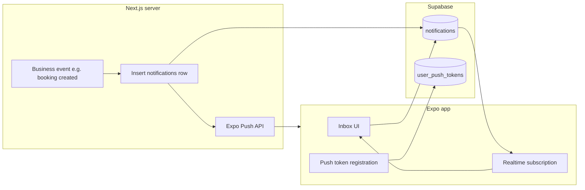

# Notifications — mobile, Supabase, and Next.js integration

This document describes **how the notifications feature works** in the ServiceLink mobile app, the **data model** in Supabase, and the **contract** your **Next.js** (or any Node) server should follow to keep in-app inbox, push banners, and navigation in sync.

For **product-level event catalog** (which business moments should notify, suggested channels), see [`detailer-notifications-guide.md`](./detailer-notifications-guide.md).

---

## Architecture (high level)



1. **Server** handles a business event → writes **`notifications`** (optional but recommended for inbox history) → reads **`user_push_tokens`** for the detailer → calls **Expo Push API** with a structured **`data`** payload.
2. **Mobile** loads the inbox from **`notifications`** (React Query), subscribes to **Realtime** `postgres_changes` on that table to refresh caches, and registers **Expo push tokens** into **`user_push_tokens`** after the user grants permission.
3. **User** opens a row in the inbox or taps a **push** → app uses **`reference_type`** + **`reference_id`** to navigate to the correct screen (same rules for both).

---

## Supabase tables

### `public.notifications`

In-app feed for the signed-in detailer. Rows are scoped with **`user_id`** = the recipient’s `auth.users.id`.

| Column            | Purpose                                                                                                                                   |
| ----------------- | ----------------------------------------------------------------------------------------------------------------------------------------- |
| `id`              | UUID primary key.                                                                                                                         |
| `user_id`         | Recipient (`auth.users.id`).                                                                                                              |
| `type`            | Stable machine string (e.g. `booking.scheduled`, `quote.requested`). Drives **minimal inbox title** and icon category on device.          |
| `reference_type`  | Lowercase category for navigation: `booking`, `quote`, `payment` (or strings containing `booking` / `appointment` for calendar entities). |
| `reference_id`    | UUID of the booking, quote, or payment entity. Required for deep links to **detail** screens where applicable.                            |
| `title`, `body`   | Optional human copy; inbox prefers minimal titles from `type` / `reference_type`. `body` / `metadata` can feed subtitle rules.            |
| `read`, `read_at` | Read state; “New” tab is unread-only.                                                                                                     |
| `created_at`      | Used for ordering, relative time, and **Recent** tab day sections (Today / Yesterday / Older) using **device local calendar**.            |
| `metadata`        | JSONB (e.g. `customerName`, `customer_name`, `fromName`, `inboxSubtitle`) for optional second line in inbox.                              |
| `dedupe_key`      | Optional server idempotency key (same logical event should not insert duplicates).                                                        |

**Mobile read path:** `src/features/notifications/api/fetchNotificationsInbox.js` selects:

`id, user_id, type, reference_type, reference_id, title, body, read, read_at, created_at, metadata, dedupe_key`

**Realtime:** `src/features/notifications/hooks/useNotificationsRealtime.js` subscribes to `postgres_changes` on `public.notifications` filtered by `user_id=eq.<id>`, with a **unique channel name per mount** to avoid Supabase client errors on remount.

### `public.user_push_tokens`

One row per **user + Expo push token** (multiple devices per user allowed).

| Column            | Purpose                              |
| ----------------- | ------------------------------------ |
| `user_id`         | `auth.users.id`                      |
| `expo_push_token` | String like `ExponentPushToken[...]` |
| `platform`        | `ios` or `android`                   |
| `updated_at`      | Last registration time               |

**RLS:** Users may only read/write rows where `auth.uid() = user_id`. The **server** must use the **service role** (or a privileged path) to read tokens when sending pushes.

**Mobile write path:** `src/features/notifications/api/upsertPushDeviceToken.js` upserts with `onConflict: 'user_id,expo_push_token'`.

**SQL reference:** [`detailer-notifications-guide.md` § Native push → Supabase table + RLS](./detailer-notifications-guide.md).

---

## Mobile app behavior (this repo)

| Concern                                           | Location / notes                                                                                                                                                                                                                                                                                                    |
| ------------------------------------------------- | ------------------------------------------------------------------------------------------------------------------------------------------------------------------------------------------------------------------------------------------------------------------------------------------------------------------- |
| Push permission + Expo token + Supabase upsert    | `src/features/notifications/components/PushTokenRegistration.jsx` (mounted from `MainTabNavigator`). Requires valid **EAS project id** in app config (`app.config.js` / `app.json` `extra.eas.projectId`; invalid `EXPO_PUBLIC_EAS_PROJECT_ID` in `.env.local` must not override a valid id — see `app.config.js`). |
| Cold start / tap on push → navigation             | `src/features/notifications/components/PushNotificationsBootstrap.jsx` + `navigationRef` on `NavigationContainer` in `AuthNavigator`.                                                                                                                                                                               |
| Foreground banner behavior                        | `index.js` — `Notifications.setNotificationHandler` (alert on, sound/badge configurable).                                                                                                                                                                                                                           |
| Inbox UI (New / Recent, mark read, errors, retry) | `src/features/notifications/screens/NotificationsInboxScreen.jsx`                                                                                                                                                                                                                                                   |
| Tap inbox row → navigate                          | `openNotificationTarget` — `src/features/notifications/utils/openNotificationTarget.js`                                                                                                                                                                                                                             |
| Tap push → same routing                           | `navigateFromPushPayload` — `src/features/notifications/utils/navigateFromPushPayload.js`                                                                                                                                                                                                                           |
| React Query keys                                  | `src/features/notifications/queryKeys.js` — `['notifications', 'inbox', userId, scope]`                                                                                                                                                                                                                             |

### Navigation rules (`reference_type` + `reference_id`)

Implemented in **`openNotificationTarget`** (shared by inbox and push):

- **`reference_type`** contains **`booking`** or **`appointment`**, and **`reference_id`** is set → **Bookings** tab → **Booking details** (`bookingId`).
- **`reference_type`** is **`quote`** → **More** stack → **Quote detail** if `reference_id` set, else **Quotes** list.
- **`reference_type`** is **`review`** (or contains `review`) → **More** stack → **Reviews** list (`reference_id` ignored for navigation).
- **`payment`**, **`payout`**, or **`deposit`** → **More** → **Payments** (`MORE_PAYMENTS`).
- Otherwise → **Bookings** list fallback.

Push payloads may use **snake_case** or **camelCase** keys; **`navigateFromPushPayload`** normalizes both.

---

## Next.js server contract

### Environment (server-only)

| Variable                      | Required                                             | Notes                                                                                                                           |
| ----------------------------- | ---------------------------------------------------- | ------------------------------------------------------------------------------------------------------------------------------- |
| `EXPO_ACCESS_TOKEN`           | Yes for authenticated Expo push sends                | Create at [expo.dev access tokens](https://expo.dev/settings/access-tokens). Never `NEXT_PUBLIC_*`, never in the mobile bundle. |
| Supabase **service role** key | Yes for reading `user_push_tokens` for any `user_id` | RLS blocks anon/session clients from reading other users’ tokens.                                                               |
| `SUPABASE_URL`                | Yes                                                  | Same project the mobile app uses for that environment (dev/staging/prod).                                                       |

### When to send a push

On the **same code path** where you insert (or have already committed) a **`notifications`** row for the detailer:

1. Resolve **`user_id`** (recipient).
2. **`select expo_push_token`** from **`user_push_tokens`** where `user_id` = recipient (service role client).
3. For each token (or batched per [Expo sending docs](https://docs.expo.dev/push-notifications/sending-notifications/)), call the Expo Push Service.

### Expo HTTP request (minimal)

- **Endpoint:** `POST https://exp.host/--/api/v2/push/send` (or current Expo documented URL).
- **Headers:** `Content-Type: application/json`, `Accept: application/json`, `Authorization: Bearer <EXPO_ACCESS_TOKEN>` when your Expo project requires it.
- **Body (per message):** at minimum:

```json
{
  "to": "ExponentPushToken[xxxxxxxxxxxxxxxxxxxxxx]",
  "title": "Short title",
  "body": "Optional subtitle",
  "data": {
    "reference_type": "booking",
    "reference_id": "uuid-here"
  }
}
```

**Contract with mobile:** `data.reference_type` and `data.reference_id` must match the semantics of the **`notifications`** row for that event (same values you store in `reference_type` / `reference_id`). The app does **not** require a separate `type` inside `data` for routing; routing is driven by **`reference_*`**.

### Idempotency

Webhooks (e.g. Stripe) and retries can fire twice. Use **`dedupe_key`** on `notifications` and/or a server-side dedupe store so you do not insert duplicate rows or send duplicate pushes for the same logical event.

### Ordering vs email

Email and in-app rows can share the same trigger; push should not block DB commits. Typical order: **commit notification (and booking data) → async send push** (queue or `after` response) so a slow Expo call does not roll back core data.

---

## Environment alignment (dev / staging / prod)

- **Mobile** uses `EXPO_PUBLIC_SUPABASE_URL` + anon key and registers tokens into the **same** project’s `user_push_tokens`.
- **Next.js** must use that **same** Supabase project for inserts and token reads; otherwise pushes will target the wrong DB or find no tokens.
- **Local full-stack testing:** see [`detailer-notifications-guide.md` § Local full-stack test](./detailer-notifications-guide.md) and [`delete-account-integration.md`](../../more/docs/delete-account-integration.md) for **`EXPO_PUBLIC_WEB_APP_URL`** and LAN IP notes.

---

## Tests (mobile)

| Area                                                   | Tests                                                                              |
| ------------------------------------------------------ | ---------------------------------------------------------------------------------- |
| Inbox UI, empty states, Recent sections, error + retry | `src/features/notifications/screens/__tests__/NotificationsInboxScreen.test.jsx`   |
| Push → navigation mapping                              | `src/features/notifications/utils/__tests__/navigateFromPushPayload.test.js`       |
| Inbox → navigation mapping                             | `src/features/notifications/utils/__tests__/openNotificationTarget.test.js`        |
| Recent day grouping                                    | `src/features/notifications/utils/__tests__/groupRecentNotificationsByDay.test.js` |
| Copy helpers                                           | `notificationMinimalTitle.test.js`, `notificationSubtitle.test.js`                 |

Run: `npm test -- --testPathPattern=notifications`

---

## Related documentation

| Doc                                                                              | Content                                                                                            |
| -------------------------------------------------------------------------------- | -------------------------------------------------------------------------------------------------- |
| [`detailer-notifications-guide.md`](./detailer-notifications-guide.md)           | Event catalog, copy guidance, SQL for `user_push_tokens`, local push testing, Expo payload example |
| [`delete-account-integration.md`](../../more/docs/delete-account-integration.md) | `EXPO_PUBLIC_WEB_APP_URL` / LAN for hitting local Next from a device                               |

---

## Changelog (maintainers)

When you add a new navigable notification type:

1. Extend **`openNotificationTarget`** (and tests) if routing changes.
2. Document allowed **`reference_type`** values for the server team.
3. Ensure **Next.js** push `data` uses the same `reference_type` / `reference_id` as the **`notifications`** insert.
